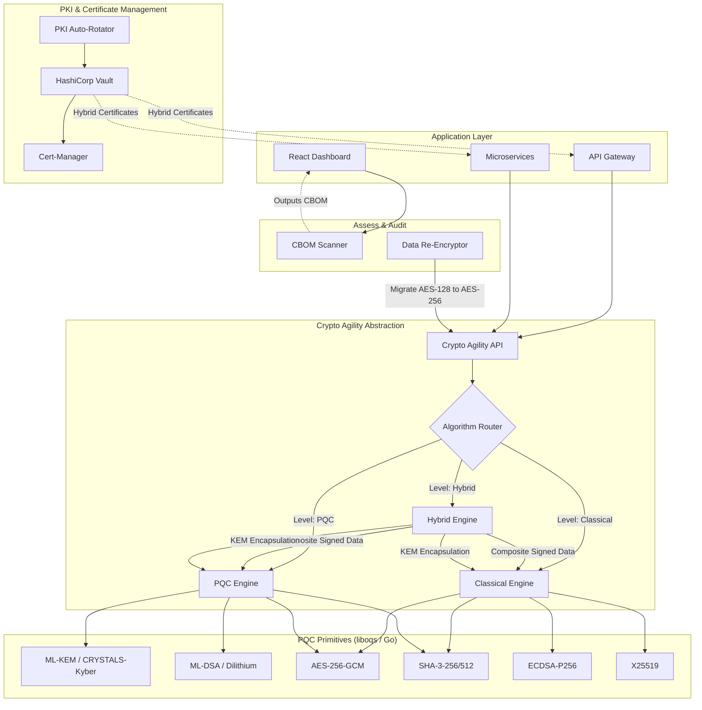

# Quantum-Ready Encryption Architecture

## System Overview
The Quantum-Ready Encryption Migration Framework provides an end-to-end pathway for transitioning existing infrastructure from classical cryptography to NIST-approved post-quantum algorithms without disrupting live operations.

## Key Components

1. **CBOM Scanner**: Recursively scans infrastructure, source code, and TLS endpoints. It identifies algorithms like AES-128, RSA-2048, and ECDSA. Outputs a structured JSON file mapping instances to their quantum vulnerability scores.
2. **Crypto Agility Layer**: The core innovation. Applications no longer use `crypto/rsa` or raw TLS suites directly. They call `provider.Encrypt(payload)` via the abstraction logic. The infrastructure decides whether to process that as classical, hybrid, or pure quantum.
3. **Hybrid Engine**: For digital signatures, the engine evaluates the payload using *both* ECDSA-P256 and ML-DSA, concatenating the results. If a client receives it, it can verify whichever half it supports. When both are verified, quantum safety is guaranteed immediately alongside zero legacy breakage.
4. **Data Re-Encryption Pipeline**: Extracts encrypted database rows under legacy `AES-128`, transparently decrypts using old keys, and rotates them to `AES-256` keys wrapped in an ML-KEM exchange.
